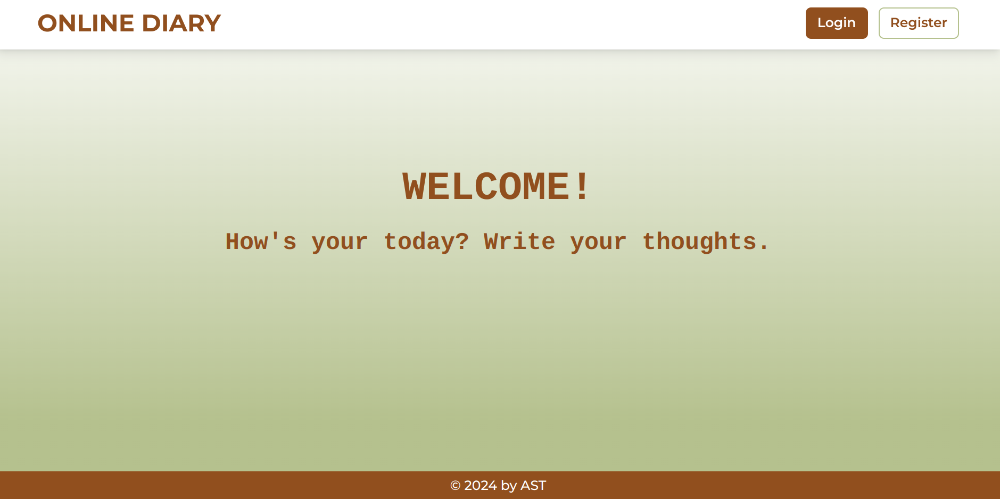
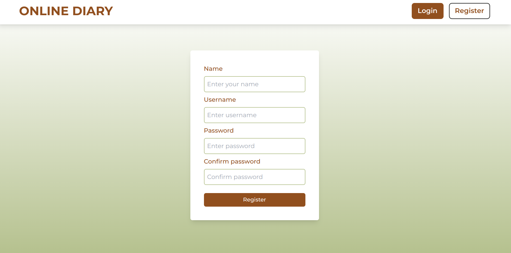
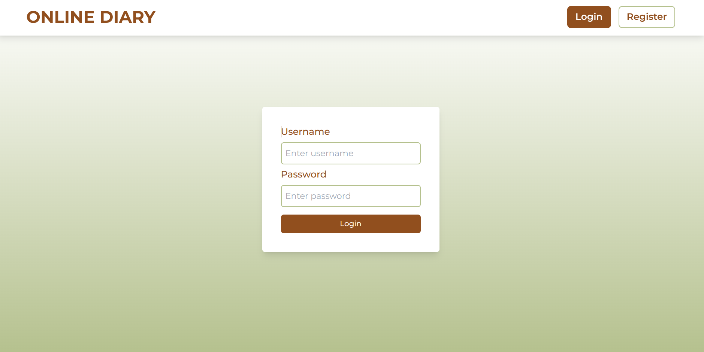
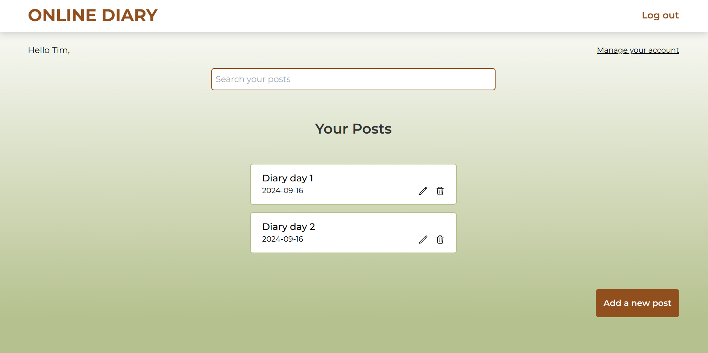
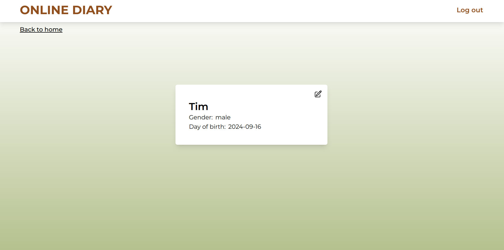
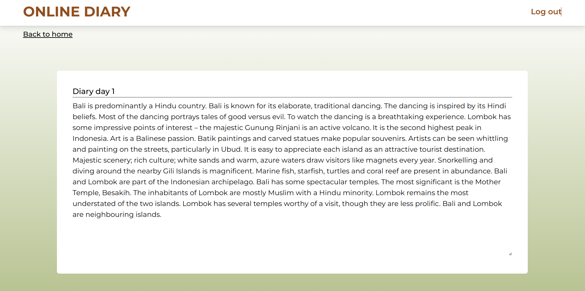

# ONLINE DIARY
## Description
This is the front-end code for a diary web app.
It's my first full-stack project after a period of learning React and Spring Boot.  

Some of the skills I have learned include:
- Creating REST APIs
- Writing unit tests
- Connecting the front-end with the back-end
- Interacting with a database using JPA & Hibernate

I know the website is not yet complete, so any feedback is welcome.  

#### Link to back-end repository: [Click here](https://github.com/AST-tnbt/Online_Diary_Backend/)
## Use-case model
Below is the use case model of the web app:  


Key features: 
- User login and registration.
- Diary management.
## Technologies
React, Tailwind CSS, Vite.
## Screenshot
Welcome page:  

  

Register page:  



Login page:  



Home page:  



User information page:  



Add post:  


Post page:  


## Installation
1. Download the front-end and back-end projects.
2. For the front-end project:
- Run the command `npm install` to install the dependences. 
- Use `npm run dev` to start the project.
3. For the back-end project:
- Connect your project with MySQL database by changing `application.properties` file:  
In my case, I am running MySQL on Docker. If you are doing the same, follow these steps: 
    1. Run the Docker, using the following command to create the database (You can change root password, username, password if you want):
    ```
    docker run --detach --env MYSQL_ROOT_PASSWORD=123 --env MYSQL_USER=user --env MYSQL_PASSWORD=123 --env MYSQL_DATABASE=online-diary --name mysql-online-diary --publish 3307:3306 mysql:8-oracle
    ```
    2. Configure the `application.properties` file:
    ```
    spring.datasource.url=jdbc:mysql://localhost:3307/online-diary
    spring.datasource.username=user
    spring.datasource.password=123
    spring.jpa.properties.hibernate.dialect=org.hibernate.dialect.MySQL8Dialect
    spring.jpa.hibernate.ddl-auto=update
    ```
    *If you are not using MySQL on Docker, simply follow step 2 and adjust the configuration according to your local MySQL setup.*

    #### All done! Just run the project and If you are not using MySQL on Docker, simply follow step 2 and adjust the configuration according to your local MySQL setup.see it.
